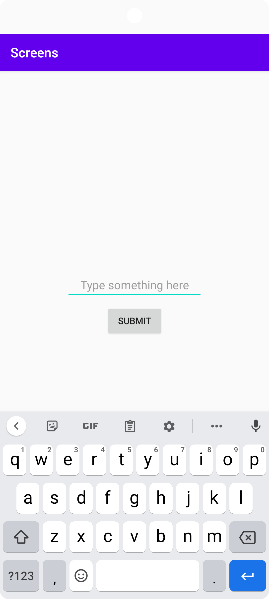
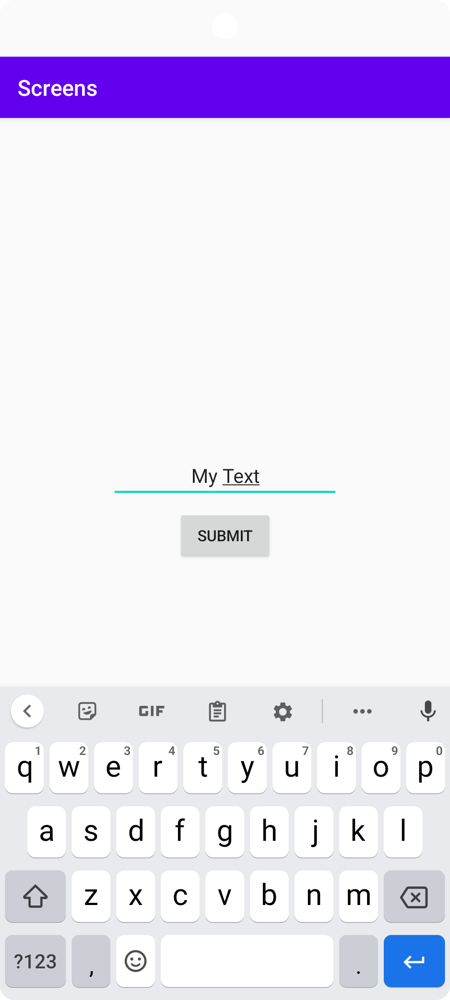
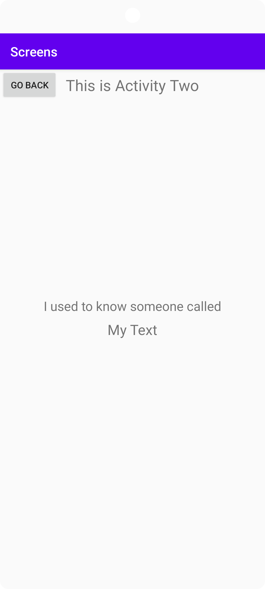

# Rapport

Forked down project and created a new layout resource file in layout folder called activity_two.xml, this will be used as a layout of something similar to a second page when compared to a website.

A new class is then created and given the name SecondActivity.java to be descriptive of what its purpose will be.
MainActivity is set as parent activity for SecondActivity.

Viewbinding is used to get around without using R.id.*view*.

Created a method for changing activities in MainActivity.java, going from main to activity two.
This is just for test purposes to see how Intents work. This method is later changed to a method that passes data.

In SecondActivity.java, an onClick method is added to call finish(); method which is used to close activity two when the user wants to go back to the first activity ("page").

An EditText component is added to main activity, where users can make an input which is then passed to activity two and displayed. See picture below:



This is achieved by modifying the method used to *only* change activities and adding intent putExtra method to bind a name (keyword) to the data that is to be passed to SecondActivity.
See code:

```
text = binding.editText;
String input = text.getText().toString();

passData(input);

private void passData(String input) {
String str = input;
    Intent intent = new Intent(this, SecondActivity.class);
    intent.putExtra("keyInput", str);
    startActivity(intent);
}
```

In SecondActivity, getIntent.getStringExtra with the same keyword 'keyInput' is used to get and save the data in a String variable.
This is then used to set the text of a TextView.

```
private TextView output;

String input = getIntent().getStringExtra("keyInput");

output.setText(input);
```

User can now input text in EditText component in main activity and click a button, which then starts activity two and displays the same text that the user had input earlier.
See picture below:




When clicking a button with value "Go Back" in activity two, the activity will be closed and the user will be returned to the main activity.
The input in the EditText will be still be there.
